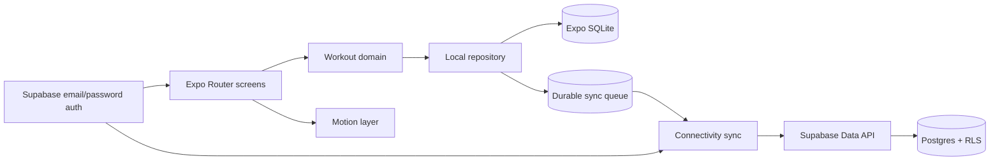

# Mobile system design

## Client boundaries

- `src/app` contains route entry points only. Screens use Expo Router stacks and native tabs.
- `src/domain` owns the 30-exercise catalog, routine templates, session creation, workload metrics, and same-routine comparison rules.
- `src/repositories` owns SQLite migrations and parameterized persistence. Cloud code never bypasses this layer when pulling data.
- `src/providers` exposes authenticated user state and the current offline snapshot.
- `src/lib/sync.ts` pushes queued mutations before pulling cloud records, preventing stale cloud data from replacing unsynced device work.

## Data and sync

SQLite stores one local profile per signed-in owner, active and historical plans, workout sessions, revisions, sync state, and a persistent mutation queue. Every editable record carries an ISO `updatedAt` value. A reconnect performs these steps:

1. Drain pending local mutations with Supabase upserts.
2. Stop and retain the queue if any push fails.
3. Pull the active profile, active plan, and recent workout history.
4. write cloud records through the local repository without re-enqueuing them.
5. Refresh the in-memory snapshot.

The Supabase migration is additive. It leaves the legacy `workout_days` table intact and adds `mobile_profiles`, `routine_plans`, and `mobile_workout_sessions`. All three tables enable RLS, grant only authenticated CRUD access, validate payload size and basic field ranges, and restrict every policy with `(select auth.uid()) = user_id`.

## Product flows

- Authentication uses email and password with optional email confirmation and password reset.
- Onboarding captures preferred name, gender, age 16+, units, height, current weight, goal weight, and a routine choice.
- Routine planning provides 3-day, 4-day, 5-day, and fully custom seven-day schedules. Each custom day can be rest or any selection from the exercise catalog.
- Workout sessions support weighted reps, assisted reps, bodyweight reps, and timed sets. Drafts persist after edits.
- Completion compares only against the previous completed session for the same routine day, then shows workload, sets, calories, and supportive copy.

## Deployment

`eas.json` includes development-client, internal preview, and production build profiles. Production store submission still needs Apple and Google developer credentials, privacy copy, screenshots, and the final commissioned character artwork.
